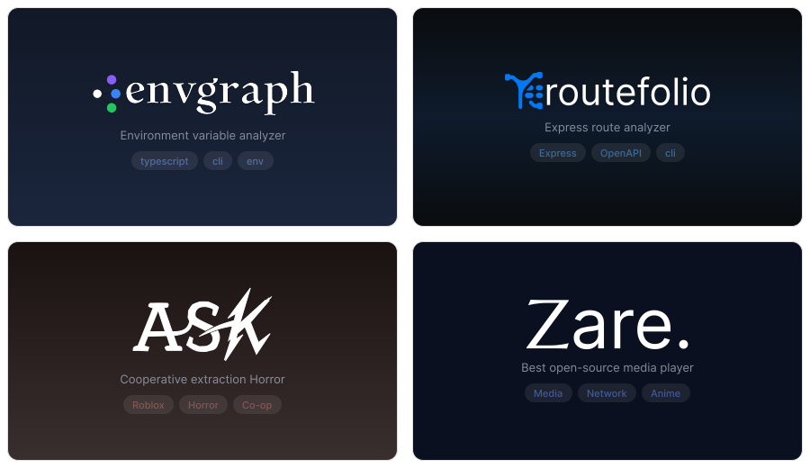

<h1 align="center">Hi! I'm Obzori</h1>
<h4 align="center">Full-Stack Developer</h4>

  Web • Backend • Frontend • Mobile • Developer Tools

  <a href="https://obzori.github.io">Portfolio</a>
  •
  <a href="https://github.com/obzori">GitHub</a>

---

## About Me

I build full-stack applications, developer tools, and experimental projects.
I enjoy designing practical systems, clean APIs, and tools that solve real problems.

## Currently Working On

**envgraph** — a CLI tool for analyzing environment variables and their usage across JavaScript/TypeScript projects.

## Projects

  

**envgraph** — Environment variable usage analyzer for JavaScript/TypeScript.

**routefolio** — Express route analyzer and OpenAPI documentation generator.

**MZDBF** — A framework for building structured Discord bots.

**A.S.K** — A cooperative extraction horror game focused on stealth, tension, and paranoia.

## Tech

**Backend:** Node.js, Express, Django, Flask
**Frontend:** React, Vue, Nuxt
**Mobile:** React Native, Swift
**Database:** PostgreSQL, SQL
**Other:** TypeScript, REST API, Git, Linux, AST tooling

Oh, and yeah. I also develop on Minecraft — mainly Fabric and NeoForge.

---

## GitHub Activity

  

---

## Contact

  
  
  

  Open to communication, ideas, and collaboration.

